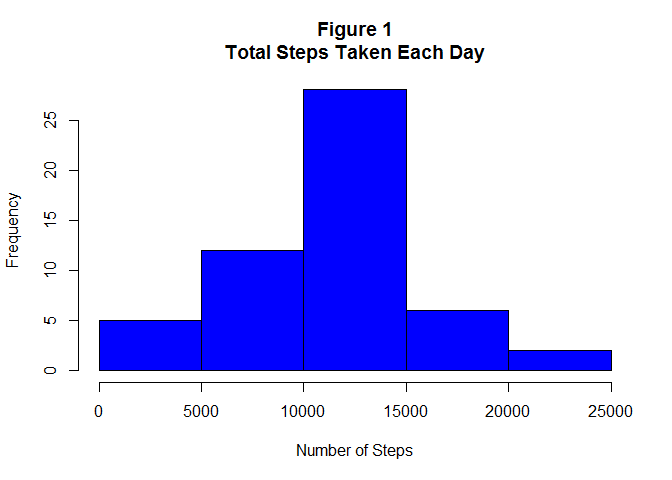
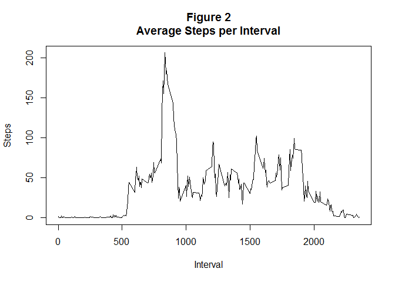
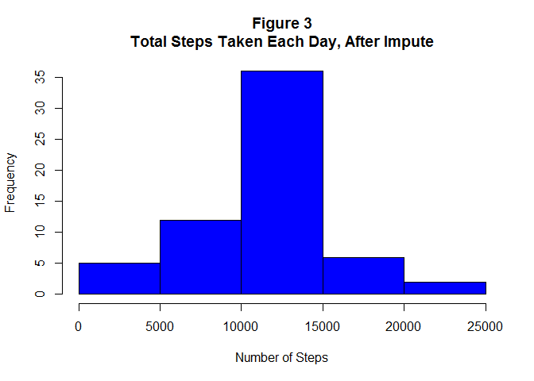
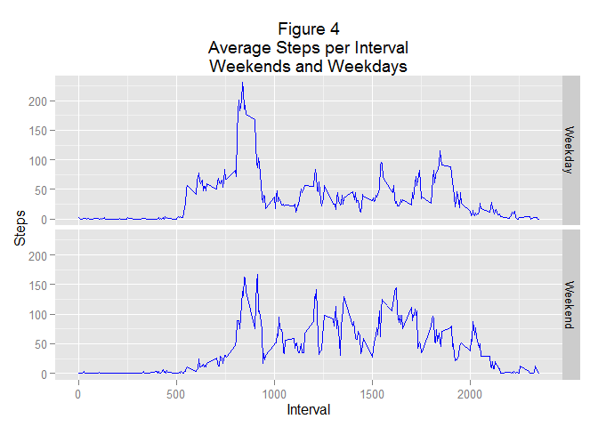

# Reproducible Research: Peer Assessment 1
Rohit Sardeshpande  

## Loading and preprocessing the data
First, let's load all libraries we need.

```r
library(ggplot2)
library(dplyr)
```

```
## 
## Attaching package: 'dplyr'
## 
## The following object is masked from 'package:stats':
## 
##     filter
## 
## The following objects are masked from 'package:base':
## 
##     intersect, setdiff, setequal, union
```

```r
library(data.table)
```

```
## 
## Attaching package: 'data.table'
## 
## The following objects are masked from 'package:dplyr':
## 
##     between, last
```

Data is present as a CSV file in the base R directory. Use ```fread``` to load data into R.

```r
f = fread("activity.csv")
```

The date would have been read into R as a character. For this work, it needs to be converted to an R class of Date.

```r
f$date = as.Date(f$date, "%Y-%m-%d")
```

## What is mean total number of steps taken per day?
Let's plot a histogram of the number of steps taken per day. This needs a summation of steps taken each day.


```r
daySum = aggregate(steps ~ date, data = f, sum)
hist(daySum$steps, main = "Figure 1\nTotal Steps Taken Each Day",
       col = "blue", xlab = "Number of Steps")
```

 

Let's calculate the mean and median total steps taken per day. ```daySum``` has the totals per day already.

```r
mean(daySum$steps)
```

```
## [1] 10766.19
```

```r
median(daySum$steps)
```

```
## [1] 10765
```

## What is the average daily activity pattern?
For this, plot a time series line graph of the average number of steps taken in each interval, across all days.

```r
intervalSteps = aggregate(steps ~ interval, data = f, mean)
plot(x = intervalSteps$interval, y = intervalSteps$steps, type = "l",
     main = "Figure 2\nAverage Steps per Interval",
     xlab = "Interval", ylab = "Steps")
```

 

The interval with the highest number of steps, on average, can be calculated with the below code.

```r
intervalSteps[which(intervalSteps$steps == max(intervalSteps$steps)),]
```

```
##     interval    steps
## 104      835 206.1698
```

## Imputing missing values
Let's count the number of intervals for which values are missing.

```r
sum(is.na(f$steps))
```

```
## [1] 2304
```

Such missing observations can distort the activity pattern plotted previously. Let's try to impute values from the available data to compensate. For this, we'll use the average number of steps taken by the person, for that interval across all days.

First, split the data read into rows having NAs and those which don't.

```r
f1 = f[which(is.na(f$steps)),]
f2 = f[which(!is.na(f$steps)),]
```

The average number of steps has already been determined and is stored in ```intervalSteps```. The below code shows that this list does not have any NAs.

```r
sum(is.na(intervalSteps$steps))
```

```
## [1] 0
```
Next, join ```f1``` and ```intervalSteps``` using ```interval``` as the common variable. This would give the average step count for those intervals which had NAs in the original file. Ensure to clean-up the resultant DF.

```r
f3 = merge(f1, intervalSteps, by = "interval")
f3 = select(f3, -steps.x)
setnames(f3, 3, "steps")
```

Combine the imputed table ```f3``` and the subset having no NAs to get the full imputed data set. But first coerce the steps in ```f2``` to be numeric to improve accuracy.

```r
f2$steps = as.numeric(f2$steps)
f4 = bind_rows(f2, f3)
```

Check if the final data set has any NAs.

```r
sum(is.na(f4$steps))
```

```
## [1] 0
```

Count rows from input file and ```f4``` to see if any rows are missing.

```r
nrow(f)
```

```
## [1] 17568
```

```r
nrow(f4)
```

```
## [1] 17568
```

Let's calculate the mean and median total steps per day, using the full imputred data set. And see the difference to the values already calculated earlier.

```r
daySumImp = aggregate(steps ~ date, data = f4, sum)
# Before impute
mean(daySum$steps)
```

```
## [1] 10766.19
```

```r
median(daySum$steps)
```

```
## [1] 10765
```

```r
# After impute
mean(daySumImp$steps)
```

```
## [1] 10766.19
```

```r
median(daySumImp$steps)
```

```
## [1] 10766.19
```

The compariosn shows that after impute, the median and mean converge to the same value. They were different earlier.

Now, let's plot a histogram of total steps per day, after imputing missing values.

```r
hist(daySumImp$steps, main = "Figure 3\nTotal Steps Taken Each Day, After Impute",
       col = "blue", xlab = "Number of Steps")
```

 

Figures 1 & 3, when compared, show a slight change in the histograms. After imputing missing values, the number of days where steps taken is between 10k-15k, has increased.

## Are there differences in activity patterns between weekdays and weekends?
Here, first we will build a new factor variable to see which dates are weekdays and which are weekends. A small function can be written to do this and ```mutate``` will add the factor to our data set.

```r
## Determines if a given date is a weekday or a weekend
detDayType = function(a) {
  b = weekdays(a)
  if(b %in% c("Saturday", "Sunday")) {
    "Weekend"
  }
  else {
    "Weekday"
  }
}
f5 = mutate(f4, daytype = lapply(f4$date, detDayType))
f5$daytype = as.character(f5$daytype)
```

Now, let's make a time series plot of the average number of steps taken, averaged across all weekday days and weekend days.

```r
dayTypeMean = aggregate(steps ~ interval + daytype, data = f5, mean)
ggplot(aes(x = interval, y = steps), data = dayTypeMean) +
  facet_grid(daytype ~ .) +
  geom_line(color = "blue") +
  labs(title = "Figure 4\nAverage Steps per Interval\nWeekends and Weekdays",
       x = "Interval", y = "Steps")
```

 
